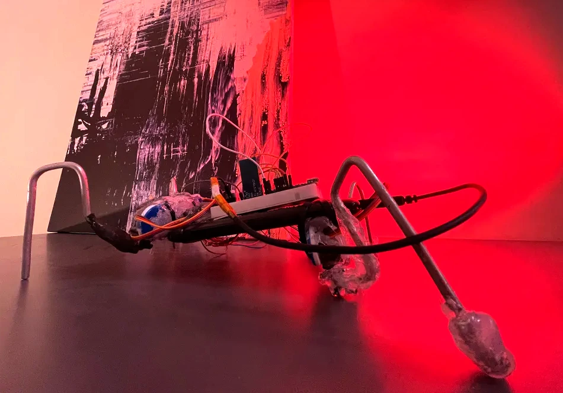

# Killer Insect Droid Automation, or KIDA

I built a small robot called KIDA. It’s a quadruped with some fun inspiration from [Martedi's Walter Photovore](https://www.hackster.io/studikasus/walter-the-arduino-photovore-insect-708207) and [BEAM robotics](http://solarbotics.net). The base is a power bank, and it's powered by 5 MG90 servos – one for each leg and one to rotate the hip of the hind leg. I used an Arduino Nano and HC05 Bluetooth module mounted on a breadboard.

The legs are made from cut-up coat hangers bent to shape, with hot glue as feet. Everything's held together with different types of glue – lots of hot glue, some MSeal to attach the legs to the motors, and even a phone holder for the hip. It’s not pretty, but I was happy to see it work with the gait I designed!

<iframe width="480" height="270" src="https://www.youtube.com/embed/_RdcMdsxoMY" allow="clipboard-write; encrypted-media; picture-in-picture; web-share" allowfullscreen></iframe>
