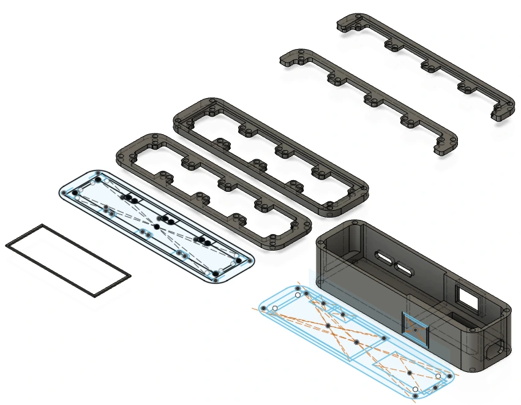
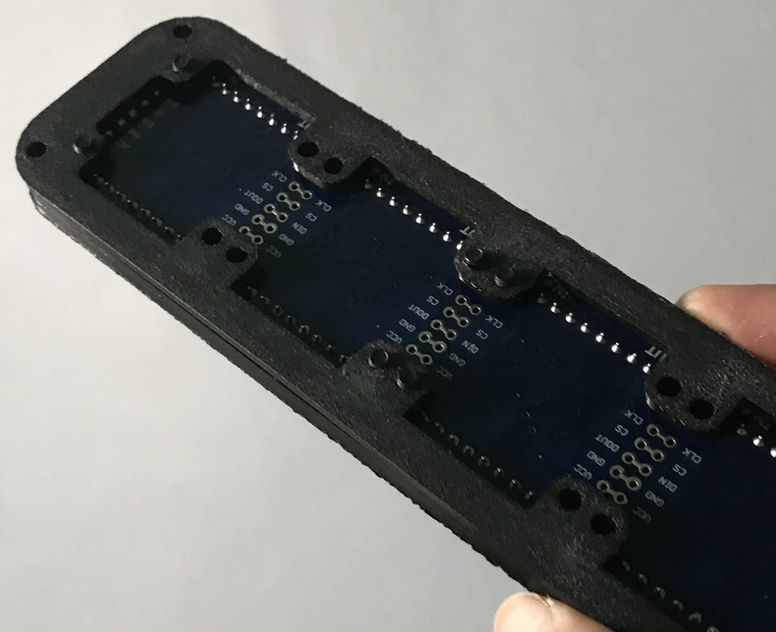
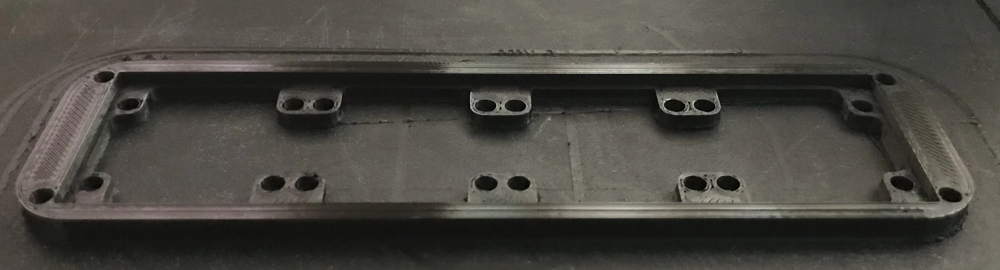

# Qlock

I've made a desk clock `qlock` using an LED matrix display, inspired in its low and wide design by the 20th century's incredibly widespread GE alarm clock radio which showed the time in 7-segment displays.

It uses a `MAX7219` 8x32 red LED matrix module consisting of four 8x8 displays, an Arduino Nano clone with micro USB, an RTC module with a `ds1302` timekeeping IC and coin cell backup, and a `TP4056` charging protection bored connected to two `18650` li-ion batteries.

This clock is able to keep track of time when unpowered by the use of the backup cell, and when powered is able to show the time from the RTC and other information sent over USB serial from any computer. I've made a python program to show certain notifications as well! I'll upload the code to github soon.

The shell has been designed in Fusion 360 and 3d-printed on an Ender 5 Pro, with four screws being used to attatch the display half to the electronics half and more to hold in the display. The screw-holes are self-tapping and shouldn't be overdriven.  
You can view, edit, and print the `.f3d` model from [the qlock github repo](https://github.com/AashvikTyagi/qlock/).

I write this in retrospect three years later and can't find pictures of the clock, so here are some pictures of the individual printed brackets:

I later found myself not using the clock, and as many of my projects end up, Qlock was dissassembled. I re-used the display and microcontroller to create a [working demo of using LED matrices as touchscreens](/#2024-05-14_Makeshift_Touch_Sensitive_LED_Matrices) with light level sensing. After that, it was used in a [Game of Life trinket](/#2024-11-02_GOLWay72:_A_Conway's_Game_Of_Life_Trinket).