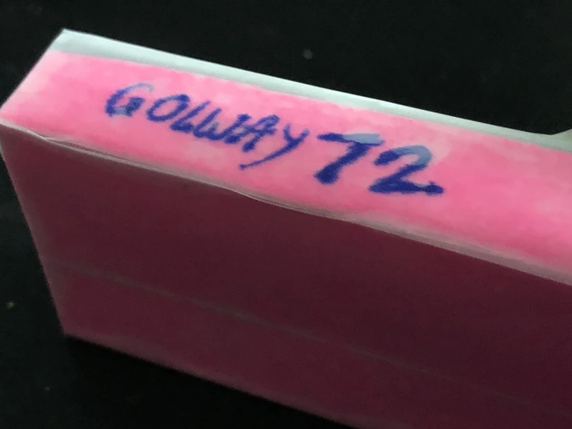

# A Conway's Game of Life Demo
<video controls autoplay loop><source src="assets/display.webm" type="video/webm"></video>

Mathematician John Horton Conway's Game of Life is a cellular automaton designed by him in 1970, featuring populated and dead cells on an infinite 2d square grid. Each 'tick', the state of a cell changes depending on the number of neighbours it had in the previous tick, simulating life in a community.  
The specific conditions are:
|--------|-------|
| <2     | dies  |
| 2 or 3 | lives |
| ≥4     | dies  |
| 3      | born  |

I've been interested in the Game of Life since I first read about it, and thoght it fairly easy to implement in software. So, using a display and 328p clone board I [had](/#2024-05-14_Makeshift_Touch_Sensitive_LED_Matrices) from a previous [project](/#2022-10-04_Qlock:_A_MAX7219_LED_Desk_Clock), I made a small desk trinket of sorts to 'mire.

Written in C (I used PlatformIO), it begins with a random state and resets every minute. Per delayed tick, carries out a very simple frame update, storing previous and current cell values. It treats the edges of the display as 'stitched' to the opposite edge ([para 5](https://en.wikipedia.org/wiki/Conway%27s_Game_of_Life#Algorithms))&mdash; that is, to look for the cell to the right of the rightmost cell, it checks the leftmost cell in that row. This is done by simply using the remainder after dividing by matrix dimensions, and is more accurate than assuming unshown cells to be dead.

Making it was trivial, and it's pretty fun to look at!

