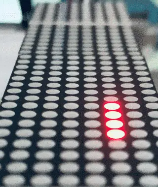

# LED Matrices as touchscreens!
I recently had the idea to use low-dpi displays and light level sensing to create a 'touchscreen' of sorts, by checking light conditions when different pixels were on.

I decided to make a demo of my idea using the MAX7219-controlled 8x32 led matrix from [Qlock](/#qlock) (which later went into [this](/#golway72)!).

The demo here works by having an STM32f103 'Blue Pill' board rapidly illuminating each pixel of the display one after the other and use ubiquitous LDR resistors to check whether any light was sensed (after an initial ambient light calibration) at each moment. Here's an example clip:

By knowing which pixels' light was blocked from reaching the photoresistor, the program I wrote in STM32CubeIDE could send the computer, over serial, which cells were blocked. For synchronizing the sensing to work reliably, I ended up slowing down the LED speed drastically.

I'm happy to see it work, and wonder what a real life use case could be, other than re-using existing non-touchscreen hardware.
