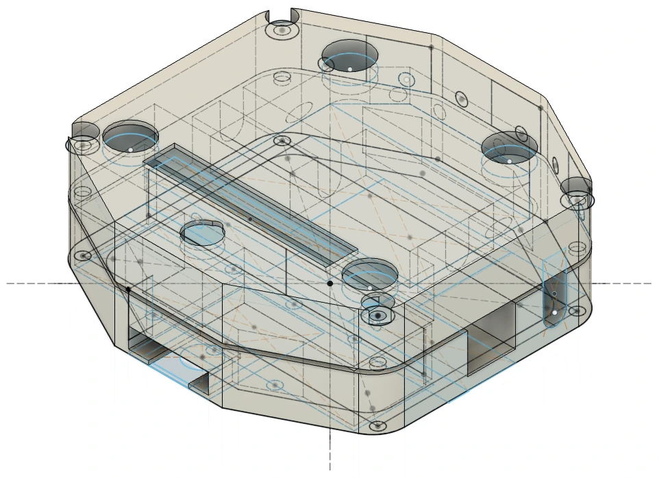
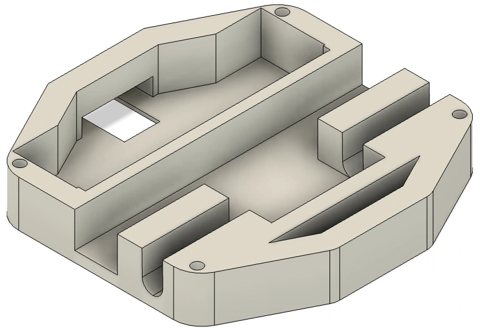

# MazeBeetle: An Attempt to Micromouse

MazeBeetle is my second foray into robots that physically solve mazes, and my first attempt at making a robot compatible with [micromouse](https://en.wikipedia.org/wiki/Micromouse) specifications.

I designed MazeBeetle in Fusion 360 as a hexagonal clamshell ([inspiration](https://matthewtran.dev/2020/10/mmv2/)) with four screws holding the top and bottom half (`.f3d` file on the [github repo](https://github.com/AashvikTyagi/MazeBeetle)). These were 3d printed, holding held the motors, battery, and charging board inside, with `VL6180X` time of flight distance sensors, a breadboard with the `TB6612FNG` motor driver, an arduino nano, and an `MPU6050` IMU PCB, attached on the outside.

I was able to get all hardware functions working independently, with reading three i2c sensors with the same address on the same bus, with calibrating the IMU reilably, and more, but it didn't work out due to problems with the bulkiness of the design and issues with the castors I was using.

Here's a WIP image from when I was testing wiring:

And the revisions before I landed on this design:

Overall, it was a decent stepping stone for my second micromouse, [`zippermau5`](/zippermau5)